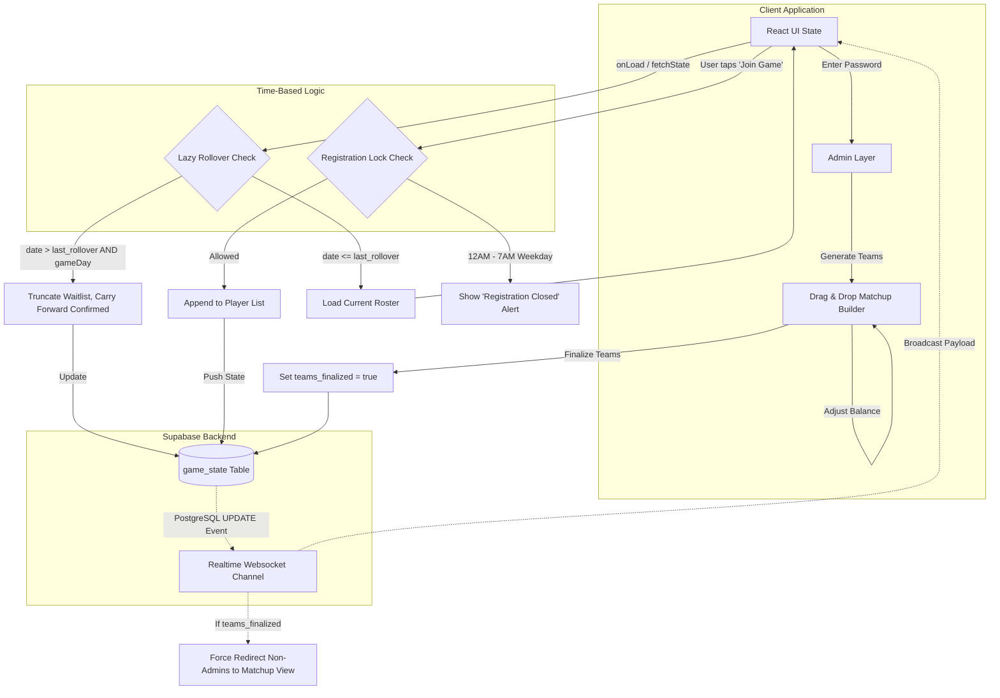

# High-Level System Architecture

This document maps out the core data flow, synchronization mechanisms, and automated business logic of the Football Team Maker application.

## 🏗 System Diagram

## 🧩 Architectural Decisions

### 1. The Single-Row State
Instead of managing complex relational tables linking `users`, `games`, and `waitlists`, the entire application runs off a **single row** in the PostgreSQL `game_state` table. This row contains JSONB objects for the players and the matchup. 

**Why?**
- Allows for true single-source-of-truth syncing. If any parameter changes (a player joins, colors toggle, teams shuffle), the entire state blob is updated via a single API call, completely eradicating race conditions where a player's waitlist position might fall out of sync with the generated teams.

### 2. Lazy Automation (Serverless)
Typically, clearing a database out at midnight requires deploying a server, setting up a Cron job, and paying for constant uptime. We bypassed this completely with **Lazy Automation**.
- The business logic for checking if the date has advanced lives directly in the React frontend's boot sequence.
- The first player to load the app after midnight inherently triggers the update logic, forcing the DB to roll over and resetting the `last_rollover_date` column so no subsequent visitors trigger it again.

### 3. Edge-Rendered Dynamic Dates
Because the frontend handles date calculation, the UI dynamically interprets Indian Standard Time (IST). Even if a player is traveling in the US or Europe, the `getISTDate()` utility forces the Javascript Date object to behave as if the user were in India, ensuring no one bypasses the 7:00 AM registration lock.
