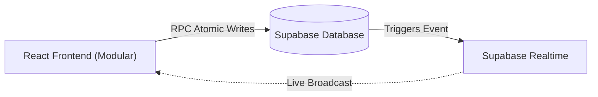

# High-Level System Architecture

This document maps out the core data flow, synchronization mechanisms, automated business logic, and directory structure of the Football Team Maker application.

## 🏗 System Diagram



## 🧩 Architectural Decisions

### 1. Modular Directory Structure
The application has been explicitly architected for scalability and maintainability by moving away from a monolithic `App.jsx` to a clean, decoupled structure:

```text
src/
├── main.jsx                          # Entry point that mounts the React application
├── index.css                         # Global design tokens, CSS variables, and resets
├── App.jsx                           # Composition shell orchestrating the global hooks and views
├── App.css                           # All component-level styling and glassmorphism rules
│
├── lib/
│   └── supabase.js                   # Initializes the Supabase client connection
│
├── config/
│   └── constants.js                  # Hardcoded values (capacity limits, themes, passwords, hours)
│
├── utils/
│   ├── time.js                       # Pure functions for calculating IST dates and format times
│   └── device.js                     # Generates and retrieves the persistent local device ID
│
├── services/
│   └── gameService.js                # Centralizes all Supabase database calls and RPC invocations
│
├── hooks/
│   ├── useGameState.js               # Main orchestrator: state, realtime, visibility, and rollover logic
│   └── useBoundaryTimer.js           # Isolated hook that forces reloads at Midnight and 7:00 AM IST
│
├── components/
│   ├── Header.jsx                    # Renders the app title and primary logo
│   ├── Toast.jsx                     # Reusable success notification banner
│   ├── ImagePreview.jsx              # View displaying the generated matchup screenshot for saving
│   │
│   ├── roster/
│   │   ├── JoinButton.jsx            # "Join Game" CTA with time-based disabling logic
│   │   ├── PlayerItem.jsx            # Single row representing a player in either list
│   │   ├── ConfirmedList.jsx         # Card displaying the active players based on current capacity
│   │   └── WaitlistCard.jsx          # Card displaying overflow players waiting for spots
│   │
│   └── matchup/
│       ├── MatchupBoard.jsx          # The main drag-and-drop arena for the generated teams
│       ├── MatchupActions.jsx        # Toolbar containing Back, Toggle Colors, and Finalize buttons
│       ├── TeamCard.jsx              # Column representing a single team and its dropped players
│       ├── SortablePlayerItem.jsx    # dnd-kit wrapper providing drag physics to a player chip
│       └── PlayerItemVisual.jsx      # Pure UI chip for the player (used in grid and as drag ghost)
│
└── logic/
    ├── teamGenerator.js              # Pure functions for Fisher-Yates shuffling and team splitting
    └── dragHandlers.js               # Extracted dnd-kit event callbacks (onDragStart, onDragEnd)
```

### 2. The Single-Row State & Atomic RPCs
Instead of managing complex relational tables linking `users`, `games`, and `waitlists`, the core application runs off a **single row** in the PostgreSQL `game_state` table containing JSONB arrays for players and the matchup configuration.

To prevent race conditions during high-traffic moments (e.g., 7:00 AM registration):
- The app uses **Atomic PostgreSQL RPC Functions** (`add_player`, `remove_player`).
- These functions execute directly on the database server to guarantee sequence integrity, automatically managing waitlist thresholds and safely resetting team drafts if capacity changes mid-draft.

### 3. Dynamic Capacity Scaling
The application natively adapts to player volume. As total registrations cross predefined constants (`10`, `14`, `18`), the active confirmed list auto-expands from a 5v5 game up to 7v7, and ultimately a 9v9 format. Anyone joining beyond the current calculated capacity falls perfectly into the waitlist.

### 4. Lazy Automation (Serverless Daily Rollover)
Typically, clearing a database waitlist at midnight requires a constantly running Node.js server and a Cron job. We bypassed this completely with **Lazy Automation**.
- The logic for checking if the date has advanced lives directly in the React frontend.
- The first user to load the app after midnight inherently triggers the update logic, forcing the DB to roll over, truncating the waitlist, and locking the `last_rollover_date` column so no subsequent visitors trigger it again.

### 5. Client-Side Time Defenses
The application utilizes aggressive, client-side safeguards to enforce IST (Indian Standard Time) constraints without hitting server limits:
- **Edge-Rendered Dates:** Dynamic conversion ensures that even if a user is traveling in a foreign timezone, their registration logic evaluates against IST, preserving the strict 7:00 AM access lock.
- **Boundary Auto-Refresh:** The `useBoundaryTimer` hook sets precise milliseconds-accurate `setTimeout` triggers that forcefully reload the browser exactly at Midnight and 7:00 AM IST. This ensures that users camping the page immediately see the open gates or the rolled-over day.
- **Bulletproof Tab Resumption:** The `visibilitychange` listener instantly refetches master state anytime the user switches tabs or re-opens their mobile browser, entirely eliminating the risk of stale views.
